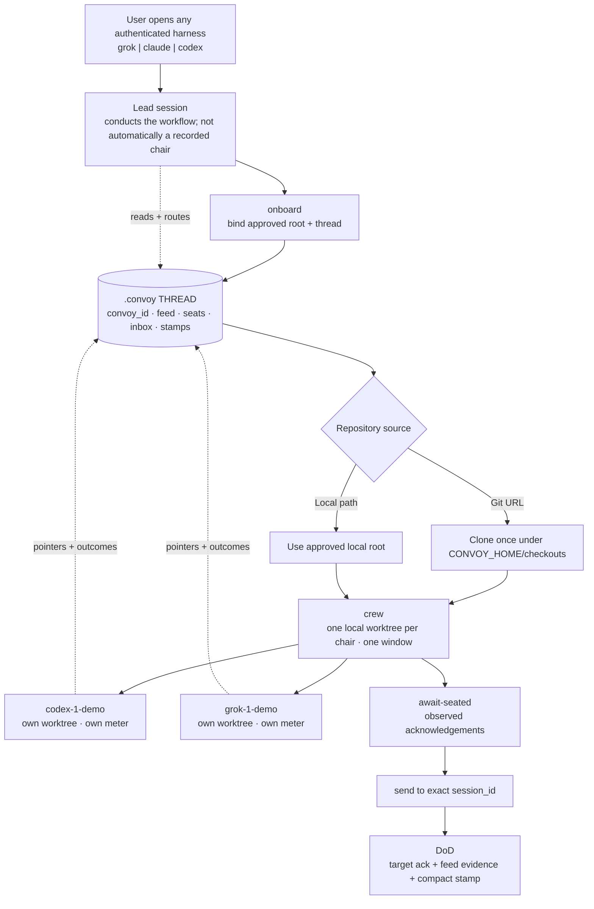

# Convoy happy path

Establish one durable Convoy thread for a repository, summon neurons from
already-authenticated AI harnesses, prove they connected, delegate work, and
leave enough shared evidence for another neuron to continue without copying a
chat transcript.

## Storage and cloud truth

A Convoy thread is a root-bound `.convoy` layer containing a `convoy_id`, feed,
seats, inboxes, and compact stamps. It is local when the MCP server runs on the
developer's machine. It is "in the cloud" only when a trusted hosted Convoy MCP
server stores that root.

A public hosted product must give each user or team an isolated root. One
global public endpoint bound to one operator root is not a multi-tenant cloud
thread. A local terminal workflow also needs a local/root-bound server because
a remote MCP process cannot safely discover or split the user's terminal.

The shared layer is durable coordination memory, not a copy of every vendor
transcript. Neurons share pointers, seats, delivery state, and concise outcomes;
vendor sessions and credentials stay with their harnesses.

## Command-true terminal flow

Prerequisites: install the Convoy CLI, sign in to the harnesses you want to use,
and start in the repository root that will own `.convoy`.

```text
# 1. Bind this root and record the installed harnesses.
convoy onboard --to claude --to codex --to grok --thread demo --checkout-root <repo-path-or-git-url> --github yes

# For a local folder with no GitHub connection, use this instead:
convoy onboard --to claude --to codex --to grok --thread demo --checkout-root <local-path> --github no

# 2. Create named chairs. crew returns the authoritative session_id values.
convoy crew --seat codex,title=codex-1 --seat grok,title=grok-1,effort=high --thread demo --launch

# With thread demo, those explicit titles produce these session ids.
convoy await-seated --seat codex-1-demo --seat grok-1-demo

# 3. Address a specific chair, not merely a harness type.
convoy send --to codex --instance-id codex-1-demo "draft tests for retry planner"
convoy send --to grok --instance-id grok-1-demo "audit retry paths"

# 4. Read from a real ISO UTC lower bound and leave a compact conclusion.
convoy feed --since 2026-09-04T00:00:00Z
convoy stamp "tests drafted"
```

`crew --launch` means a terminal spawn was attempted. It is not proof that the
new neurons connected. Only `await-seated` returning `connected` for each
returned chair closes that loop. Likewise, `send` returning `queued` is not
delivery; the target must drain its inbox and author an acknowledgement.

The terminal opened first can act as the human's lead session, but Convoy does
not silently record "first process wins" as thread authority. `convoy lead`
explicitly records a lead transfer between already identified chairs.

## OpenAI plugin flow

Installing `convoy@convoy` grants the declared MCP connection and bundled skill.
The plugin uses MCP tools rather than translating the shell commands above:

1. Inspect the configured endpoint's live tool list.
2. Stop with `mutation_attempted: false` unless the guided flow's tools are all
   present.
3. Read `card`, resolve the repository, and get approval for the root/thread.
4. Call `onboard`, then one `crew` call for all selected neurons.
5. Observe `await_seated`, `neurons`, and `graph` before routing work.
6. Call `send`, then require the target-authored inbox acknowledgement.

The default public package advertises `Interactive` and `Read`. Full crew
creation requires an isolated, trusted endpoint that intentionally exposes the
write-gated lifecycle tools. Installing the public plugin alone does not turn a
shared public process into a local terminal controller.

## System map



## Sequence view

```mermaid
sequenceDiagram
    actor U as User
    participant Lead as Lead session (any harness)
    participant CV as Root-bound Convoy thread
    participant C1 as codex-1-demo
    participant G1 as grok-1-demo

    U->>Lead: open an authenticated harness
    Lead->>CV: onboard approved root and thread
    CV-->>Lead: convoy_id minted; root bound
    Lead->>CV: crew with two titled seats and launch=true
    CV-->>C1: worktree minted; chair joined; boot prompt
    CV-->>G1: worktree minted; chair joined; boot prompt
    C1->>CV: seated token acknowledgement
    G1->>CV: seated token acknowledgement
    Lead->>CV: await-seated for returned session ids
    CV-->>Lead: connected / connected
    Lead->>C1: send to exact chair (queued)
    Lead->>G1: send to exact chair (queued)
    C1->>CV: inbox drain + authored acknowledgement
    G1->>CV: inbox drain + authored acknowledgement
    Lead->>CV: stamp compact conclusion
    Note over Lead,G1: Shared coordination state; separate vendor sessions and meters
```

## Definition of done

- One approved root has exactly one durable `convoy_id` and thread binding.
- Every local chair has a unique worktree.
- The crew card identifies every returned `session_id`; no example guesses it.
- Every chair is `connected` by its own seated acknowledgement.
- Each routed message is addressed to an exact chair and acknowledged by that
  occupant; `queued` alone is not counted as delivered.
- The feed and final stamp contain conclusions and pointers, not credentials,
  vendor tokens, or full transcripts.
- A new identified neuron can read the thread layer and resume from those
  pointers.
- A hosted version isolates roots per user/team and exposes writes only through
  authenticated, scoped policy.
